  
    
  <table>
    <tr>
      <td valign="top"></td>
      <td valign="top"></td>
    </tr>
  </table>

## André Medrado

**Analista de Dados & BI | Logística, Transporte e Supply Chain**

Engenheiro de Produção (CREA-RJ). Trabalho na fronteira entre operação e dado: construo modelos, pipelines e dashboards que mudam decisão de operação — não relatório que ninguém abre.

### Resultados em operação real

| Resultado | Como |
| --- | --- |
| **-87% no tempo de espera de descarga** (15 → 2 dias) | Automação da priorização de pátio com Python + SQL |
| **1.600 veículos** monitorados em torre de controle | Pipeline atualizando a cada 10 min; dashboards a cada 30 min |
| **-15% no custo de transporte** | Redesenho de roteirização e análise de desempenho de transportadoras |
| **6 dashboards em produção**, 20+ usuários | Modelo estrela com 10+ tabelas fato/dimensão, publicado e administrado no Power BI Service |

### Projetos

**Torre de Controle Logística — Power BI**

Operação de transporte de combustível sem visibilidade de SLA, ocorrências e tempo de trânsito. Construí o modelo estrela, ~140 medidas DAX e 8 páginas de análise, do resumo executivo ao detalhe por veículo.

### Stack

**No dia a dia** — Power BI (DAX, modelagem estrela) · Power Query · SQL Server · Excel Avançado (VBA) · Python (Pandas)

**Em evolução** — Databricks · Microsoft Fabric · Power Automate · Power Apps · Engenharia de Dados

**Sistemas de operação** — TMS Trafegus · WMS · SAP MM · TOTVS Protheus

### Formação

- MBA em Business Intelligence & Analytics 360 — Xperiun (2026)
- MBA em Logística e Supply Chain — Faculdade Única (2023)
- Engenharia de Produção — CREA-RJ
- Lean Six Sigma Yellow Belt

### Contato

[LinkedIn](https://www.linkedin.com/in/andr%C3%A9-medrado/) · amedradopaiva@gmail.com · Rio de Janeiro, Brasil
