<div align="center">


[](#formação-e-certificações)
[](#formação-e-certificações)
[](https://github.com/medradox)

[](#projetos-em-destaque)
[](https://www.linkedin.com/in/andr%C3%A9-medrado/)
[](mailto:amedradopaiva@gmail.com)
[](https://github.com/medradox)

[](https://github.com/medradox?tab=followers)
[](https://github.com/medradox?tab=repositories)

</div>

---

## Sobre mim

**Analista de Dados & BI | Power BI · SQL · Python**

Transformo dados em modelos analíticos, dashboards e automações que apoiam decisões de negócio. Minha atuação conecta entendimento do problema, tratamento dos dados, definição de indicadores e entrega de análises utilizáveis no dia a dia.

Sou Engenheiro de Produção e desenvolvo soluções com **Power BI, DAX, SQL Server e Python**, com experiência em modelagem dimensional, pipelines de atualização e publicação no Power BI Service. Meu foco está na clareza dos indicadores, na consistência dos modelos e no impacto mensurável das análises.

**Aberto a:** conexões e conversas sobre Análise de Dados, Business Intelligence, automação analítica e projetos de dados.

---

## Tech stack

| Área | Tecnologias |
| :--- | :--- |
| Linguagens e análise | Python · SQL · DAX · Pandas |
| Visualização e BI | Power BI · Power Query · Excel Avançado |
| Bancos e modelagem | SQL Server · Modelagem dimensional · Modelo estrela |
| Automação e entrega | Python · VBA · Power BI Service |
| Em desenvolvimento | Microsoft Fabric · Databricks · Power Automate · Power Apps · Engenharia de Dados |

<p align="center"><a href="https://github.com/medradox?tab=repositories"></a></p>

---

## Especialidades em dados

| Domínio | Atuação | Aplicação |
| :--- | :--- | :--- |
| Business Intelligence | Experiência prática | Dashboards, indicadores e publicação no Power BI Service |
| Modelagem de dados | Experiência prática | Modelos estrela e tabelas fato/dimensão |
| Análise com SQL e Python | Experiência prática | Tratamento, priorização e automação de rotinas |
| DAX e Power Query | Experiência prática | Medidas, regras de negócio e transformação de dados |
| Engenharia de Dados | Em desenvolvimento | Ampliação de conhecimentos em Fabric e Databricks |

---

## Projetos em destaque

<details open>
<summary><strong>Plataforma de indicadores e análise de desempenho — Power BI</strong></summary>

Solução de BI que transforma dados operacionais em uma visão executiva e permite investigar indicadores até o detalhe do registro.

| Dimensão | Detalhes |
| :--- | :--- |
| Stack | Power BI · DAX · Power Query · Modelagem estrela |
| Escala | Aproximadamente 140 medidas DAX e 8 páginas de análise |
| Entrega | Visão executiva, indicadores de SLA, ocorrências e tempos de processo |
| Impacto | Visibilidade dos indicadores e apoio à investigação de desvios |
| Código | Projeto profissional; repositório público não disponibilizado |

O trabalho combina estruturação do modelo semântico, tradução de regras de negócio em medidas e organização da navegação do resumo ao detalhe.

</details>

<details>
<summary><strong>Automação de priorização e análise de processos — Python + SQL</strong></summary>

Automação de uma rotina de priorização para apoiar decisões com dados e reduzir o tempo de espera em um processo operacional.

| Dimensão | Detalhes |
| :--- | :--- |
| Stack | Python · SQL |
| Aplicação | Priorização de filas operacionais |
| Impacto | Redução de 87% no tempo de espera, de 15 para 2 dias |
| Código | Projeto profissional; repositório público não disponibilizado |

Uma aplicação de análise e automação orientada a um resultado verificável de negócio.

</details>

<details>
<summary><strong>Perfil analítico automatizado — Python + GitHub Actions</strong></summary>

Indicadores públicos do GitHub gerados como SVG e atualizados automaticamente.

| Dimensão | Detalhes |
| :--- | :--- |
| Stack | Python · SVG · GitHub Actions |
| Escala | Calendário anual de contribuições e métricas públicas |
| Atualização | Execução diária e manual |
| Segurança | Dados públicos; permissão de escrita restrita ao workflow |
| Repositório | [medradox/medradox](https://github.com/medradox/medradox) |

O projeto aplica coleta, validação, transformação e apresentação de dados em um fluxo reproduzível.

</details>

---

## Experiência aplicada

**Análise de Dados & Business Intelligence**

Experiência na construção e manutenção de soluções analíticas utilizadas por equipes de negócio:

- Modelagem dimensional com mais de 10 tabelas fato/dimensão.
- Desenvolvimento e administração de 6 dashboards em produção para mais de 20 usuários.
- Pipelines com atualização a cada 10 minutos e dashboards a cada 30 minutos.
- Tradução de necessidades de negócio em indicadores e análises de desempenho.
- Automação de rotinas com Python e SQL.

`Power BI` · `DAX` · `SQL Server` · `Python` · `Modelagem de Dados` · `Analytics`

---

## Resultados

| Resultado | Evidência de impacto |
| :--- | :--- |
| **87% menos espera** | Priorização automatizada: de 15 para 2 dias |
| **6 dashboards em produção** | Soluções de BI utilizadas por mais de 20 usuários |
| **1.600 ativos monitorados** | Visibilidade analítica de uma operação com 1.600 veículos |
| **15% de redução de custos** | Análise de desempenho e redesenho de processos de transporte |

---

## Formação e certificações

**Xperiun**

[](https://github.com/medradox)

MBA em Business Intelligence & Analytics 360 — 2026.

**Faculdade Única**

MBA em Logística e Supply Chain — 2023.

**Formação complementar**

Engenharia de Produção · CREA-RJ · Lean Six Sigma Yellow Belt.

---

## Código e portfólio

[](https://github.com/medradox?tab=repositories)

Os projetos profissionais descritos acima não possuem código público disponibilizado neste perfil.

---

## GitHub Analytics

<div align="center">

<a href="https://github.com/medradox?tab=repositories"></a>


</div>

---

## Atividade de contribuições

<p align="center"><a href="https://github.com/medradox"></a></p>

---

## Contribution Snake

<p align="center"></p>

---

## Foco atual

```yaml
learning:
  - Microsoft Fabric e Databricks
  - Engenharia de Dados
building:
  - Soluções de BI e indicadores de negócio
  - Automações analíticas com Python e SQL
exploring:
  - Power Automate e Power Apps
open_to:
  - Análise de Dados
  - Business Intelligence
  - Colaboração em projetos de dados
```

---

## Vamos conversar

[](mailto:amedradopaiva@gmail.com)
[](https://www.linkedin.com/in/andr%C3%A9-medrado/)
[](https://github.com/medradox)
[](#projetos-em-destaque)

---

<p align="center"><em>Dados bem estruturados. Análises claras. Decisões melhores.</em></p>

