  <a href="https://www.linkedin.com/in/andr%C3%A9-medrado/">LinkedIn</a> &nbsp; · &nbsp;
  <a href="mailto:amedradopaiva@gmail.com">E-mail</a> &nbsp; · &nbsp;
  <a href="https://github.com/medradox?tab=repositories">Repositórios</a> &nbsp; · &nbsp;
  Rio de Janeiro, Brasil

### Dados que ajudam a decidir

Sou **Analista de Dados & BI**, com formação em Engenharia de Produção. Desenvolvo modelos analíticos, dashboards e automações com **Power BI, SQL e Python**, conectando perguntas de negócio a indicadores que as equipes conseguem utilizar.

Minha experiência inclui modelagem dimensional, medidas DAX, tratamento de dados e publicação no Power BI Service — do entendimento da necessidade à manutenção da solução em produção.

### Entregas em produção

| **6 dashboards** | **20+ usuários** | **87% menos espera** |
| :--- | :--- | :--- |
| Desenvolvidos e administrados no Power BI Service | Utilizando as soluções de BI no dia a dia | De 15 para 2 dias, com priorização automatizada em Python e SQL |

### Projetos e aplicações

**Business Intelligence · Indicadores de desempenho**

Modelo analítico com aproximadamente **140 medidas DAX e 8 páginas**, conectando uma visão executiva à investigação detalhada de indicadores. A solução organiza métricas de desempenho, ocorrências e tempos de processo para apoiar o acompanhamento do negócio.

Ver abordagem técnica

- Modelagem estrela e organização de tabelas fato e dimensão.
- Transformação de dados com Power Query e regras de negócio em DAX.
- Navegação do resumo executivo ao detalhe para investigar desvios.
- Aplicação profissional em uma torre de controle; código não publicado.

**Tecnologias:** Power BI · DAX · Power Query · Modelagem dimensional.

 

**Automação analítica · Priorização com Python e SQL**

Automatizei uma rotina de priorização que contribuiu para reduzir o tempo de espera de **15 para 2 dias**. O trabalho conectou tratamento de dados e regras de negócio a uma decisão recorrente da operação.

Ver aplicação e resultado

- Uso de Python e SQL na automação da priorização de pátio.
- Redução de 87% no tempo de espera de descarga.
- Aplicação profissional; código não publicado.

**Tecnologias:** Python · SQL.

### Ferramentas e conhecimentos

| Área | Tecnologias e práticas |
| :--- | :--- |
| **Business Intelligence** | Power BI · DAX · Power Query · Power BI Service |
| **Análise e automação** | Python · Pandas · SQL · Excel Avançado · VBA |
| **Modelagem** | SQL Server · Modelo estrela · Tabelas fato e dimensão |
| **Em desenvolvimento** | Microsoft Fabric · Databricks · Engenharia de Dados |

### Formação

- **MBA em Business Intelligence & Analytics 360** — Xperiun, 2026.
- **Engenharia de Produção** — CREA-RJ.
- **Lean Six Sigma Yellow Belt.**

Formação complementar

MBA em Logística e Supply Chain — Faculdade Única, 2023.

### No GitHub

Uso este espaço para desenvolver meu portfólio público de dados. O [repositório deste perfil](https://github.com/medradox/medradox) contém a coleta e a geração do calendário abaixo com Python e GitHub Actions.

Ver atividade de contribuições

---

**Vamos conversar sobre dados?** Entre em contato pelo [LinkedIn](https://www.linkedin.com/in/andr%C3%A9-medrado/) ou por [e-mail](mailto:amedradopaiva@gmail.com).
